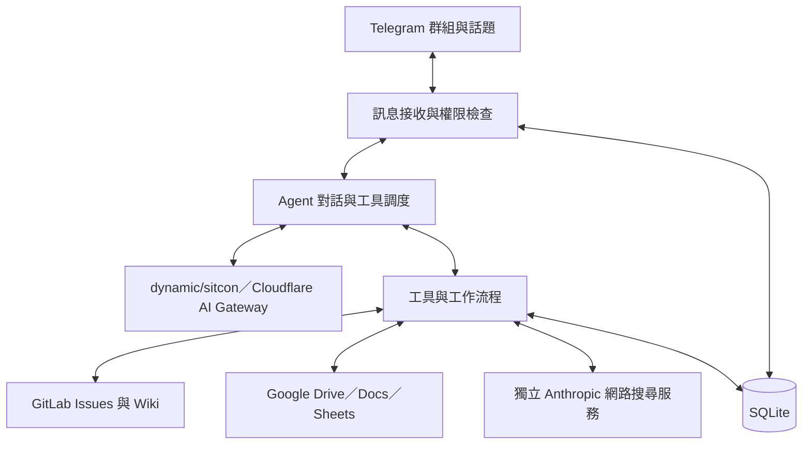

# SITCON 編輯組小石

小石是 SITCON 長期編輯組的 Telegram AI 助理，將 GitLab 看板、Google 文件、人員名冊與編輯知識整合到群組對話中，協助成員完成開卡、分工、文案送審與通知。

專案以 Python 實作，透過模型理解自然語言，再由具備參數驗證與權限檢查的工具執行操作。

## 主要功能

- **任務管理**：建立與查詢 GitLab 卡片，調整負責人、標籤、到期日及狀態。
- **文案管理**：選擇「開卡＋建立文案」時，建立 Drive 資料夾與範本 Google Docs，串連卡片與文件。
- **校稿與簽到**：批次送審，PDF、review 通知與簽到按鈕合併為同一則 Telegram 訊息；閱讀簽到同步至原文件。只要求 review 時，成功後不另發完成摘要。
- **團隊通知**：依名冊標註作者、總副召或全體編輯組成員，通知留在原群組與話題中。
- **知識查詢**：查閱 GitLab Wiki、相關 Google 文件與公開網路資訊，提供來源連結。
- **群組記憶**：保存成員明確要求記住的工作偏好，依群組分開管理。

開卡提供兩種方式：

| 方式 | 建立的資源 |
| --- | --- |
| 僅開卡（預設） | GitLab 卡片。 |
| 開卡＋建立文案 | GitLab 卡片、Drive 資料夾與 Google Docs。 |

## 如何呼叫小石

在已授權群組中，以下四種訊息會觸發小石：

1. 以小石的 Telegram tag（`@bot帳號`）開頭。
2. 以「小石」開頭，例如「小石，列出尚未關閉的卡片」。
3. 以 `review` 開頭，後接空白與卡號，例如 `review #123 #124`；單獨 `review` 也可觸發，英文大小寫不拘。
4. 使用 Telegram 的回覆功能，回覆小石的訊息。

開頭從第一個字元比對，不略過前置空白或換行。訊息中途提到「小石」、tag 或 review，以及標註其他帳號，都不會觸發；回覆小石時則不限制開頭。既有斜線指令、補問選項與簽到按鈕維持原本用途。

## 系統架構



訊息入口負責群組授權、觸發判斷與對話歸屬。Agent 理解需求後選擇工具；缺少必要資訊時會向原提問者補問，工具執行前再驗證參數與操作範圍。

主模型以 `dynamic/sitcon` 透過 Cloudflare AI Gateway 的 Chat Completions 介面進行推論。網路搜尋由獨立的 Anthropic 服務處理，將查詢結果與引用來源交回主模型。

服務採單一 Docker Compose 容器，以 Telegram long polling 接收訊息，不提供公開 HTTP API，也不需開放對外連入的連接埠。

## 技術組成

| 項目 | 技術與用途 |
| --- | --- |
| 執行環境 | Python 3.12，以非同步方式處理訊息與外部 API 請求。 |
| Telegram | python-telegram-bot，支援群組話題、互動按鈕與訊息限流。 |
| AI 介面 | OpenAI／Anthropic SDK，透過 adapter 封裝模型訊息與工具呼叫。 |
| 外部整合 | httpx、Google API Client 與 Google Auth，存取看板、文件及名冊。 |
| 設定與驗證 | Pydantic、pydantic-settings，管理環境變數與工具參數。 |
| 資料儲存 | SQLite、aiosqlite，保存操作進度與群組資料。 |
| 建置與部署 | uv 鎖定依賴，Docker Compose 管理執行環境。 |
| 品質檢查 | pytest、respx、Ruff，涵蓋自動化測試、API 模擬與程式碼格式。 |

## 資料與狀態管理

GitLab 是卡片、標籤與編輯 Wiki 的資料來源；Google Sheets 提供人員名冊與帳號對照；Google Drive 與 Docs 保存文案及相關檔案。

SQLite 保存群組授權、長期記憶、操作進度、資源連結、通知狀態、PDF 快照與簽到紀錄。多步驟操作會記錄已完成的階段，讓中途失敗的工作可以接續，降低重複建立資源的風險。短期對話與待回答問題保存在記憶體中，重啟後失效。

## 專案結構

```text
src/editorial_bot/
├── gateway.py       # Telegram 訊息與互動入口
├── agent/           # 對話流程、提示詞與工具定義
├── services/        # AI、GitLab、Google 與業務流程
├── storage/         # SQLite 存取
└── settings.py      # 環境設定
migrations/          # 資料庫版本遷移
tests/               # 自動化測試
scripts/             # 服務檢查與維護工具
docs/                # 部署與維護文件
```

## 相關文件

- [專案設計](PROJECT.md)：詳細資料流、工具介面、設計決策與限制。
- [功能規格](SPEC.md)：使用情境、權限與功能行為。
- [部署與維護](docs/DEPLOYMENT.md)：環境準備、啟動、測試與備份。
- [環境變數範例](.env.example)：外部服務與執行設定。
